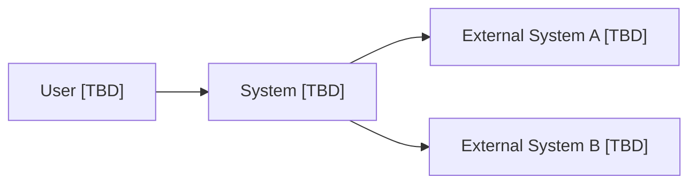
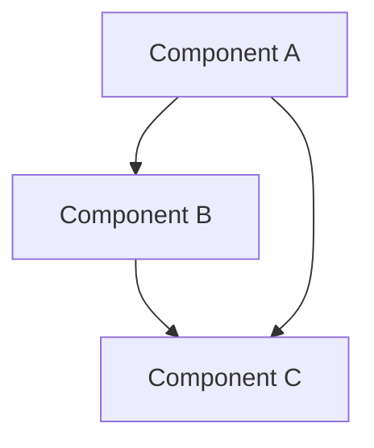
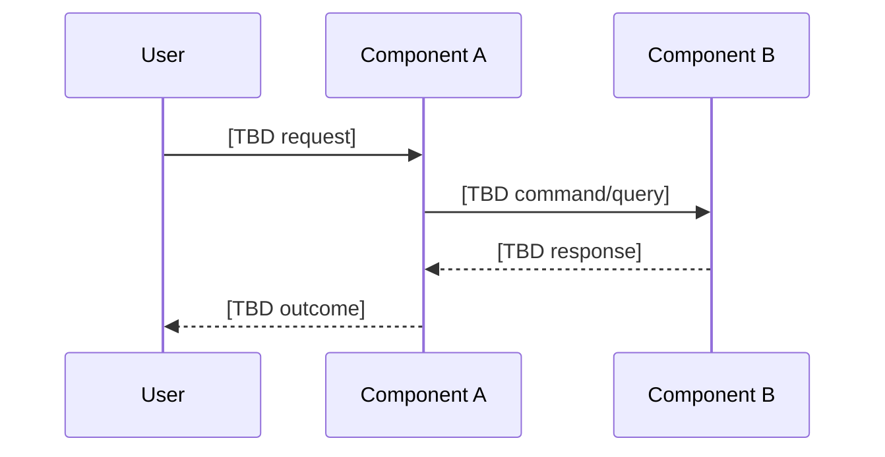
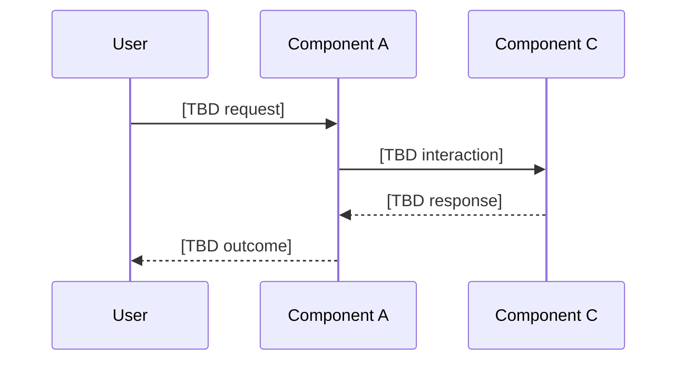
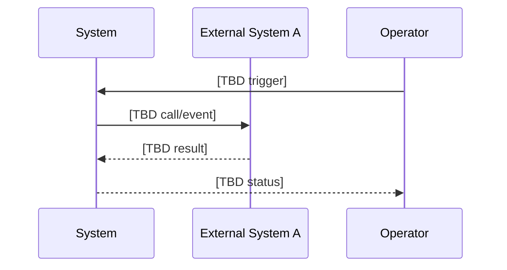

# 02 - Architecture

Lean architecture spec (implementation-agnostic, arc42-inspired).

## Architecture Goals
- [TBD]

## Constraints
- [TBD]

## System Context and Scope
- In scope: [TBD]
- Out of scope: [TBD]
- External actors/systems: [TBD]

## Solution Strategy
- Architectural style: [TBD]
- Core principles: [TBD]
- Tradeoff posture: [ASSUMPTION]

## Building Blocks (Modules/Components)
- Component A: [TBD responsibility]
- Component B: [TBD responsibility]
- Component C: [TBD responsibility]
- Contracts between components: [OPEN QUESTION]

## Runtime View (Top 3 Scenarios)

### Scenario 1: [TBD]

### Scenario 2: [TBD]

### Scenario 3: [TBD]

## Deployment View (Abstract)
- Runtime units: [TBD]
- Network boundaries: [TBD]
- Environment model: [TBD]
- Scaling assumptions: [ASSUMPTION]

## Cross-Cutting Concepts
- Security: [TBD]
- Observability: [TBD]
- Configuration and secrets: [TBD]
- Error handling and retries: [TBD]
- API and schema versioning: [TBD]

## Risks and Mitigations
- Risk: [TBD] | Impact: [TBD] | Mitigation: [TBD]
- Risk: [TBD] | Impact: [TBD] | Mitigation: [TBD]

## Glossary
- Term: [TBD]
- Term: [TBD]

## Gate 2 Checklist (Ready for Implementation)
- [ ] Context diagram present.
- [ ] Container/building-block diagram present.
- [ ] Three runtime scenarios documented.
- [ ] Interfaces/contracts are specified abstractly.
- [ ] At least two ADRs exist in `docs/adr/`.

