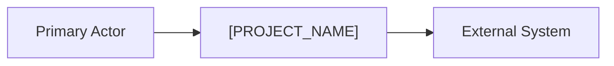
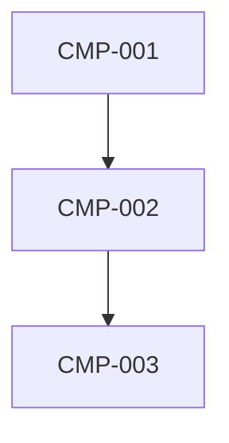
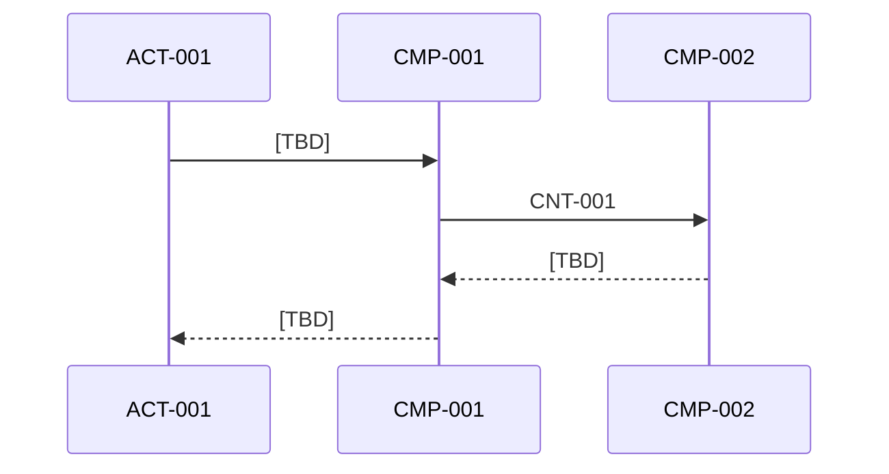

# 06 - Architecture

## Purpose
- Define the system structure, runtime behavior, deployment shape, and cross-cutting concepts.

## Architecture Goals
- `[TBD]`
- `[TBD]`

## Context And Boundaries
- In scope: `[TBD]`
- Out of scope: `[TBD]`
- External systems: `[TBD]`

## Components
| Component ID | Component | Responsibility | Notes |
|---|---|---|---|
| `CMP-001` | `[TBD]` | `[TBD]` | `[TBD]` |
| `CMP-002` | `[TBD]` | `[TBD]` | `[TBD]` |
| `CMP-003` | `[TBD]` | `[TBD]` | `[TBD]` |

## Runtime Views
### Scenario `SCN-001`

## Deployment Shape
- Runtime units: `[TBD]`
- Data boundaries: `[TBD]`
- Scaling posture: `[TBD]`
- Environment model: `[TBD]`

## Cross-Cutting Concepts
- Security: `[TBD]`
- Observability: `[TBD]`
- Configuration and secrets: `[TBD]`
- Error handling: `[TBD]`
- Versioning and compatibility: `[TBD]`

## Risks
| Risk ID | Risk | Impact | Mitigation |
|---|---|---|---|
| `RISK-001` | `[TBD]` | `[TBD]` | `[TBD]` |
| `RISK-002` | `[TBD]` | `[TBD]` | `[TBD]` |

## Inputs
- Contracts from `docs/05-contracts.md`.
- Runtime scenarios from `docs/03-scenarios.md`.
- Relevant ADRs from `docs/adr/`.

## Outputs
- A stack-independent structural design for implementation.
- Runtime and deployment guidance tied back to capabilities and constraints.

## Assumptions
- Components can be defined by responsibility and contract boundaries without choosing concrete frameworks.

## Open Questions
- Whether a completed instance needs multiple deployment options documented.

## Related IDs
- `CMP-001`
- `CNT-001`
- `SCN-001`
- `NFR-001`
- `ADR-0001`
