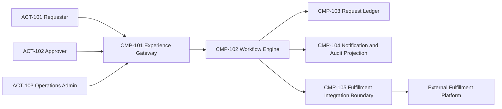
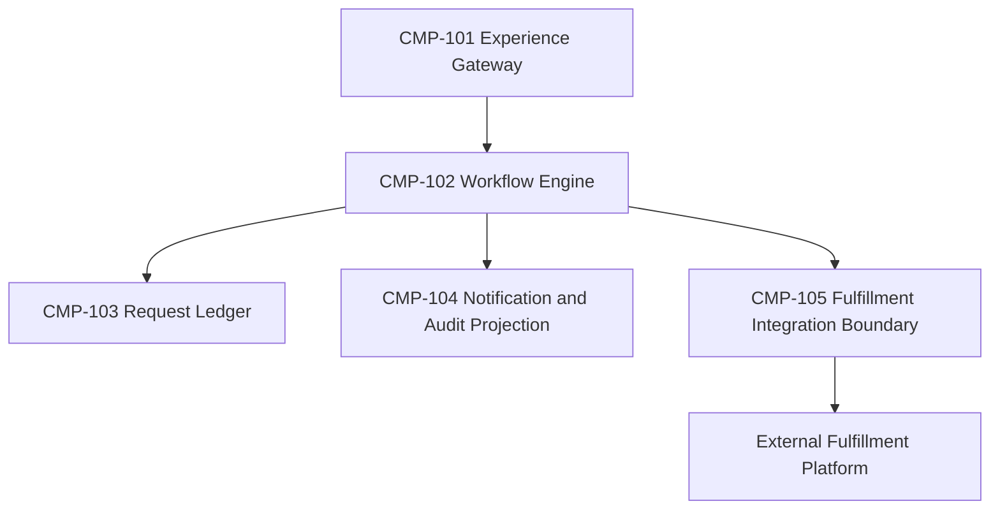
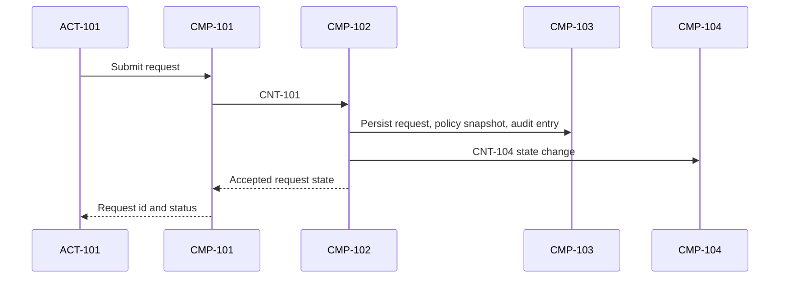
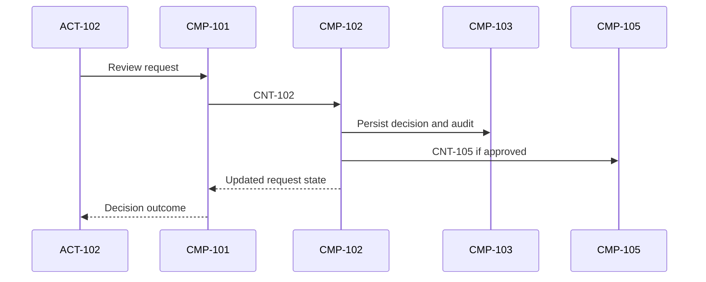
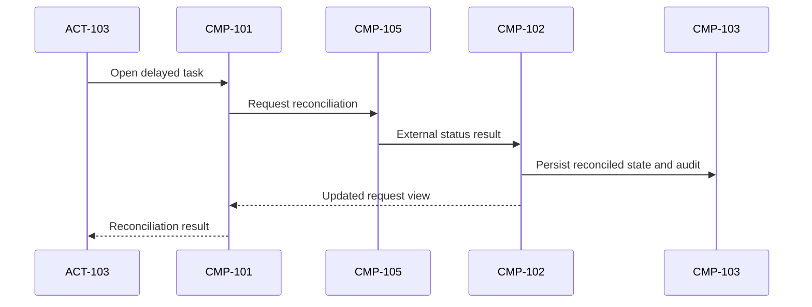

# 06 - Architecture

## Purpose
- Define the system structure, runtime views, deployment shape, and cross-cutting concepts for Flow Approval Hub.

## Architecture Goals
- Preserve deterministic workflow and audit history.
- Isolate external fulfillment dependencies from core request state.
- Keep the experience-facing boundary simple for requesters and approvers.

## Context And Boundaries
- In scope: `request intake, approval routing, request view retrieval, notification triggers, fulfillment task issuance, reconciliation`
- Out of scope: `downstream work execution, enterprise identity provider implementation, analytics warehousing`
- External systems: `identity provider, fulfillment platform, notification delivery channels`

## Components
| Component ID | Component | Responsibility | Notes |
|---|---|---|---|
| `CMP-101` | Experience Gateway | Accepts actor requests, performs edge validation, and exposes request views | Can be delivered through UI plus API, but the design treats it as one boundary |
| `CMP-102` | Workflow Engine | Owns request lifecycle, approval policy evaluation, decisions, and event emission | Implements the state machine from `ADR-0001` |
| `CMP-103` | Request Ledger | Stores current request view, policy snapshot, fulfillment summary, and immutable audit entries | Logical persistence boundary, not a prescribed datastore |
| `CMP-104` | Notification and Audit Projection | Builds actor-facing notifications and operator-facing timelines from state changes | May consume events asynchronously |
| `CMP-105` | Fulfillment Integration Boundary | Translates approved requests into downstream tasks and reconciles external status | Shields core components from external system semantics |

## Runtime Views
### Scenario `SCN-101`

### Scenario `SCN-102`

### Scenario `SCN-103`

## Deployment Shape
- Runtime units: `At minimum, the experience boundary, workflow engine, logical ledger, and integration boundary must exist even if some are co-deployed.`
- Data boundaries: `Request and audit data remain inside the ledger boundary; downstream task state may be cached locally but the external system remains source of truth for execution details.`
- Scaling posture: `Read-heavy request viewing can scale separately from workflow processing if needed.`
- Environment model: `One production environment plus at least one lower environment with fulfillment integration simulation.`

## Cross-Cutting Concepts
- Security: `Actor identity is verified before commands or queries execute; authorization is enforced in the workflow engine using capability and policy context.`
- Observability: `Core commands and events emit success, failure, and lag signals tied to request and correlation identifiers.`
- Configuration and secrets: `Policy definitions, integration credentials, and notification routing are managed as configuration, not embedded in request data.`
- Error handling: `Validation and business rule failures are synchronous; downstream failures are retried and escalated operationally without losing committed local state.`
- Versioning and compatibility: Contract evolution follows the policy in `ADR-0002` and uses additive change by default.

## Risks
| Risk ID | Risk | Impact | Mitigation |
|---|---|---|---|
| `RISK-101` | External fulfillment updates arrive late or not at all | Requesters and operators may see stale status | Reconciliation workflow, lag alerts, idempotent task issuance |
| `RISK-102` | Approval policy changes after a request enters routing | Decisions become inconsistent or disputed | Snapshot policy at submission and retain it in the ledger |

## Inputs
- Contracts from `docs/05-contracts.md`.
- Scenarios from `docs/03-scenarios.md`.
- Accepted ADRs from `docs/adr/`.

## Outputs
- A complete stack-independent architecture and runtime view for implementation.

## Assumptions
- The core workflow and ledger responsibilities should remain distinct even if physically co-located.

## Open Questions
- None.

## Related IDs
- `CMP-101`
- `CNT-101`
- `SCN-101`
- `NFR-101`
- `ADR-0001`
